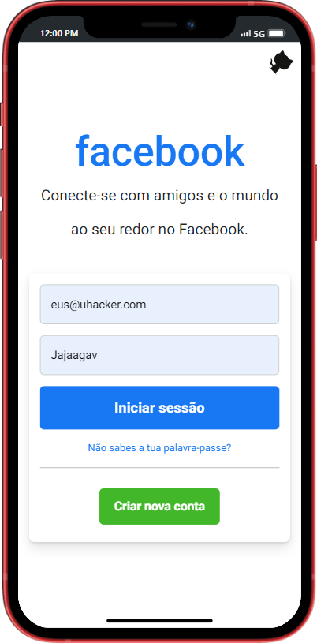
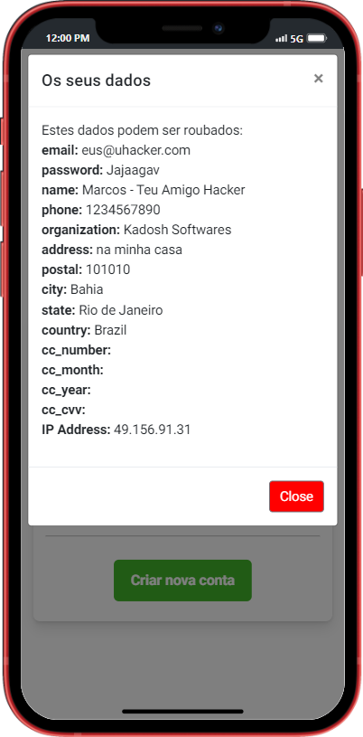

# Phishing por Autofill

Este repositório demonstra uma vulnerabilidade de phishing por autofill em navegadores modernos. Mostra como mesmo os navegadores mais recentes podem ser suscetíveis a esse tipo de ataque básico, que já existe há muitos anos.

## Por Que Esse Ataque Funciona

Muitos navegadores modernos oferecem recursos de preenchimento automático para melhorar a conveniência do usuário, preenchendo automaticamente os campos do formulário com dados salvos. No entanto, essa conveniência pode ser explorada devido a:

- **Campos Ocultos**: Os atacantes podem ocultar campos de entrada em uma página da web, que são preenchidos automaticamente sem o conhecimento do usuário.
- **Confiança no Preenchimento Automático**: Os usuários costumam confiar que o preenchimento automático só preencherá campos visíveis, sem saber que campos ocultos também podem ser preenchidos.

  

## Como Esse Ataque Funciona

Esse ataque explora o recurso de preenchimento automático dos navegadores. Aqui estão os principais passos envolvidos:

1. **Formulário Web Criado**: O atacante cria um formulário web com campos visíveis e ocultos.
2. **Interação do Usuário**: O usuário visita o site malicioso e interage com os campos visíveis do formulário.
3. **Acionamento do Preenchimento Automático**: O recurso de preenchimento automático do navegador preenche automaticamente tanto os campos visíveis quanto os ocultos com dados salvos do usuário.
4. **Extração**: Os campos ocultos capturam informações sensíveis sem o conhecimento do usuário, que são então enviadas para o atacante.

## Imagem

Veja abaixo um exemplo visual que ilustra como o formulário pode ser estruturado:

 

# **Sugestões para Proteção**

### 1. Verifique o URL do Site

- **Certifique-se de que está no site correto**: Sempre verifique a URL do site antes de inserir informações pessoais. Confirme que está visitando o site legítimo e que a URL é segura (`https://`).

### 2. Use Navegadores Atualizados

- **Atualize seu navegador**: Mantenha seu navegador atualizado para garantir que você tenha as últimas correções de segurança. Navegadores atualizados ajudam a proteger contra vulnerabilidades conhecidas.

### 3. Desative o Preenchimento Automático para Sites Não Confiáveis

- **Desative autofill**: Em configurações do navegador, você pode desativar a função de preenchimento automático para campos de formulários, especialmente para sites que não são de sua confiança.

  - **Google Chrome**:
    1. Vá para **Configurações**.
    2. Selecione **Senhas e Formulários**.
    3. Clique em **Senhas** e desative a opção de salvar senhas.

  - **Mozilla Firefox**:
    1. Vá para **Preferências**.
    2. Selecione **Privacidade e Segurança**.
    3. Na seção **Senhas**, desmarque **Perguntar se deve salvar logins e senhas para sites**.

### 4. Use Gerenciadores de Senhas

- **Adote gerenciadores de senhas**: Utilize gerenciadores de senhas confiáveis, como LastPass, 1Password ou Bitwarden. Esses aplicativos ajudam a armazenar e preencher informações de forma segura e também podem detectar sites fraudulentos.

### 5. Verifique os Campos do Formulário

- **Evite preencher campos suspeitos**: Se você notar campos estranhos ou ocultos em um formulário, especialmente em sites que não são de sua confiança, não preencha esses campos.

### 6. Esteja Atento a Phishing

- **Cuidado com e-mails e mensagens**: Não clique em links ou forneça informações pessoais a partir de e-mails ou mensagens suspeitas. Verifique sempre a autenticidade dos remetentes e das URLs dos links.

### 7. Use a Verificação em Duas Etapas (2FA)

- **Ative 2FA**: Sempre que possível, ative a verificação em duas etapas para suas contas online. Isso adiciona uma camada extra de segurança ao exigir uma segunda forma de autenticação além da senha.

### 8. Monitore Suas Contas

- **Verifique contas regularmente**: Monitore suas contas bancárias e de cartão de crédito para detectar qualquer atividade suspeita ou não autorizada.

## 🌐 Redes Sociais

Conecte-se conosco e acompanhe as atualizações do repositório:

- 

- 

- 

Desenvolvido por **João Marcos Jová**.

